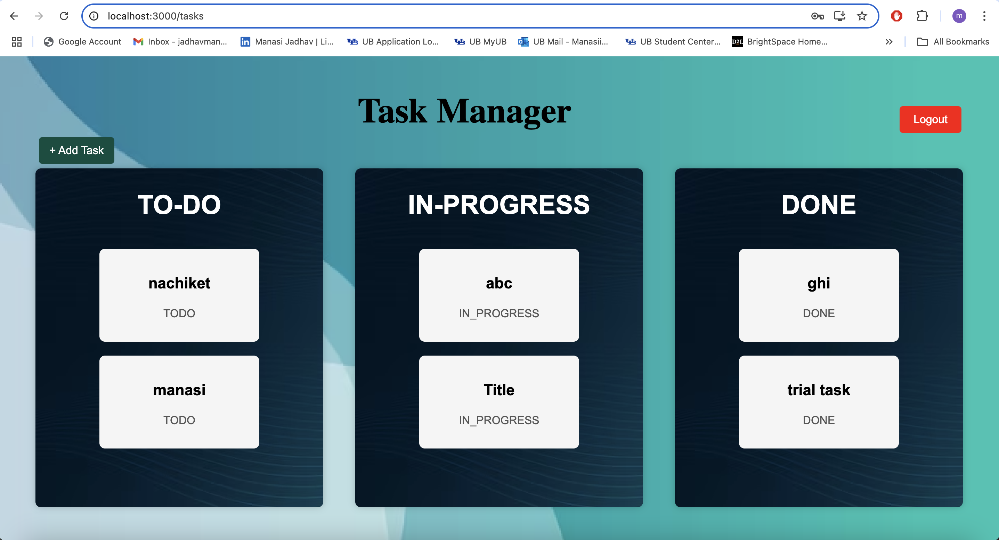

# Task Manager Application

## A full-stack task management system built with **Spring Boot** (backend) and **React.js** (frontend).

## 🚀 Features
- User authentication (Login & Registration)
- Task CRUD operations (Create Task, Edit Task, Delete Task, Update Task)
- Drag-and-drop task management

## 🛠️ Prerequisites
Ensure you have the following installed:
- **Git/Github** (to clone the repository)
- **Java 17+** (for backend)
- **Maven** (for dependency management)
- **Node.js + npm** (for frontend)
- **PostgreSQL** (for database)

## ⚡ Quick Start

### Backend (Spring Boot)
1. Check if Git is present or not
    ```bash
    git --version
    ```

2. Clone the repository:
    ```bash
   git clone https://github.com/ManasiJadhav3012/task-manager.git
   cd taskmanager/
   ```

3. Check if Java is present or not
    ```bash
    java -version
    ```

4. Check if maven is present or not
    ```bash
    mvn -version
    ```


5. Check if PostgreSQL is present or not
    ```bash
    psql --version
    ```

6. Create database in PostgreSQL
    ```bash
    psql -U postgres
    CREATE DATABASE taskmanager;
    \l
    \c taskmanager
    \dt
    ```

7. Make following changes in the **\task-manager\src\main\resources\application.properties** 
    ```bash
    spring.datasource.password=ENTER_YOUR_PASSWORD_INSTEAD_OF_THIS_TEXT
    ```
    on above line add password value as your PostgreSQL application password.

8. Install Dependencies and run
    ```bash
    mvn clean install
    mvn spring-boot:run
    ```

### Frontend (React.js)
9. Navigate to frontend
    ```bash
    cd task-manager/frontend
    ```

10. Kill if any process is using port 8080.
    **For mac**
    ```bash
    lsof -i :8080
    kill -9 <PID>
    ```
    Here instead of <PID> write a PID number gotten from first command.

    **For Windows**
    ```bash
    netstat -ano | FindStr :8080
    taskkill /PID <PID> /F
    ```
    Here instead of <PID> write a PID number gotten from first command.

11. Check if npm is present or not.
    ```bash
    npm -version
    ```

12. If above command fails due to security issues even though npm is present in system then try
    ```bash
    npm.cmd -version
    ```

13. Install Dependencies and run
    ```bash
    npm install
    npm start
    ```

14. If above commands fail due to security issues even though npm is present in system then try
    ```bash
    npm.cmd install
    npm.cmd start
    ```


Once the application is up and running you will be able to see following pages as you navigate through the application.

### **1. Create Task Page**


### **2. Edit/Delete Task Page**


### **3. Login Page**


### **4. Registration Page**


### **5. Tasks Page**
